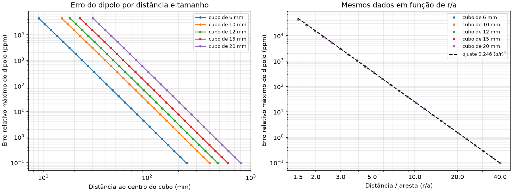

# Fase 2 — Modelo de campo: dipolo pontual × cubo exato

O código original trata cada cubo de NdFeB como um dipolo magnético pontual.
Esta fase adiciona o campo analítico exato de um cubo uniformemente
magnetizado (`magpylib`) e mede quanto o dipolo erra.

Tudo aqui é reproduzível com:

```bash
uv run python scripts/compare_field_models.py
```

As saídas ficam em [resultados/fase2/](resultados/fase2/): `resumo.json`,
`erro_dipolo_cubo_isolado.csv` e os gráficos citados abaixo.

## Os dois modelos

| | Dipolo (`dipole`) | Cubo exato (`cuboid`) |
|---|---|---|
| Campo | `B = μ0/4π · [3(m·r)r/r⁵ − m/r³]`, com `m = Br·a³/μ0` | expressão analítica do cubo por cargas superficiais (Yang 1990, Engel-Herbert 2005) via `magpylib.core.magnet_cuboid_Bfield` |
| Orientação do cubo | irrelevante | o corpo gira em torno de z junto com a magnetização, que fica normal a uma face |
| Tabela de campos, cabeça (12 slots × 19 opções × 4662 pontos) | 5 s | 76 s |

**Validação do modelo exato** (`tests/test_field_model.py`):
- reproduz a interface de objetos do magpylib (`Cuboid` com `orientation`) com erro relativo < 10⁻⁹, o que confirma a rotação para o referencial local e de volta;
- longe do cubo, tende ao dipolo com `m = Br·V/μ0`;
- a direção de B0 no centro de um anel continua igual a `field_direction` (os testes de direção rodam com os dois modelos).

## Resultado 1 — erro do dipolo para um cubo isolado



Para cubos de 6, 10, 12, 15 e 20 mm, com distâncias de 1,5 a 40 arestas,
calculou-se o erro relativo `|B_dip − B_exato| / |B_exato|`. Foi usado o maior
valor sobre 400 direções e 4 orientações do cubo.

- **As curvas de todos os tamanhos se sobrepõem quando plotadas em função de
  r/a** (gráfico da direita). O erro só depende da distância medida em arestas.
  Isso é esperado: as equações não têm outra escala de comprimento.
- **O erro cai como (a/r)⁴.** O ajuste para r/a ≥ 5 dá

  **erro máximo ≈ 0,246 · (a/r)⁴**

  O expoente 4 também tem explicação: num cubo, a correção de quadrupolo se
  anula por simetria, e o primeiro termo depois do dipolo é de ordem 4. O teste
  `test_cuboid_tends_to_dipole_far_away` verifica a inclinação 4 ± 0,1.

Regra prática para o projeto:

| r/a | erro máximo do dipolo |
|---|---|
| 3 | ~3000 ppm |
| 5 | ~400 ppm |
| 10 | ~25 ppm |
| 20 | ~1,5 ppm |

## Resultado 2 — efeito no arranjo completo

Para cada cenário foram comparados:
(a) 300 soluções aleatórias avaliadas com os dois modelos;
(b) o GA rodado com cada modelo, com a solução avaliada nos dois.

| | Cabeça (DSV 200 mm) | Membros (DSV 110 mm) |
|---|---|---|
| Distância mínima ímã → borda do DSV | ~48 mm (r/a ≈ 4) | ~33 mm (r/a ≈ 2,8) |
| Correlação de postos (Spearman) do ppm, 300 soluções aleatórias | 0,999997 | 0,99998 |
| Diferença pontual máxima do campo, soluções aleatórias | 127 ppm | 1381 ppm |
| Diferença no campo médio (mediana) | 0,1 ppm | 0,9 ppm |
| Mapa da diferença no plano z = 0 (ótimo exato) | −9 a +9 ppm | −105 a +130 ppm |
| **Erro do ppm do dipolo na mesma solução ótima** | **−2 a +4 ppm (≤ 0,5%)** | **+63 ppm (3,7%)** |

Mapas da diferença no plano central:
[cabeça](resultados/fase2/diferenca_mapa_head.png),
[membros](resultados/fase2/diferenca_mapa_limb.png).
O padrão tem 4 lóbulos (cos 4φ), a assinatura da correção de ordem 4.
Ele é praticamente zero no centro e cresce perto da borda do DSV, onde os
ímãs estão mais próximos.

Dispersão ppm dipolo × exato:
[cabeça](resultados/fase2/ppm_dipolo_vs_exato_head.png),
[membros](resultados/fase2/ppm_dipolo_vs_exato_limb.png).

### A variação do GA pesa mais que o erro do modelo

No cenário da cabeça, o GA rodado com o dipolo chegou a 786 ppm, e o GA rodado
com o modelo exato chegou a 734 ppm, uma solução diferente. A diferença **não é
erro do dipolo**: avaliada com o dipolo, a solução de 734 ppm também é melhor
(738 ppm). O GA com dipolo apenas não a encontrou. Ou seja, com a mesma
configuração do GA, **a variação entre execuções (~7%) é maior que o erro do
modelo (≤ 0,5%)**. Isso reforça a importância da Fase 4 (MILP), que dá o ótimo
global e mede quanto o GA deixa na mesa.

## Conclusões

1. **Para ordenar soluções, o dipolo é quase perfeito** nos dois cenários
   (Spearman > 0,9999). Otimizar com o dipolo e confirmar com o modelo exato é
   uma estratégia válida para explorar rápido.
2. **Para números absolutos, o dipolo não serve no cenário de membros.** Os
   ímãs ficam a menos de 3 arestas da borda do DSV, e o erro chega a 3,7% no ppm
   e a mais de 1000 ppm num ponto isolado.
3. **O erro cresce rápido com o tamanho do cubo.** Com cubos maiores (menos
   ímãs, montagem mais simples), o erro cresce com a⁴: dobrar a aresta
   multiplica o erro por 16.
4. **Decisão:** o padrão passou a ser `model.backend = "cuboid"`. O custo extra
   é de ~70 s de pré-cálculo na cabeça e ~2 s nos membros, feito uma única vez
   por execução, e a Fase 3 vai paralelizá-lo. O dipolo continua disponível
   (`--backend dipole`) para varreduras rápidas.
